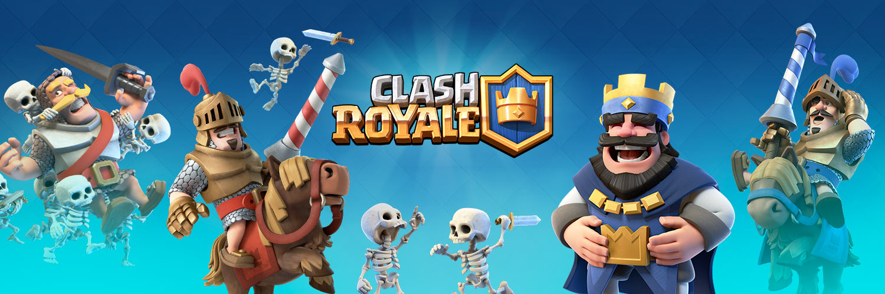
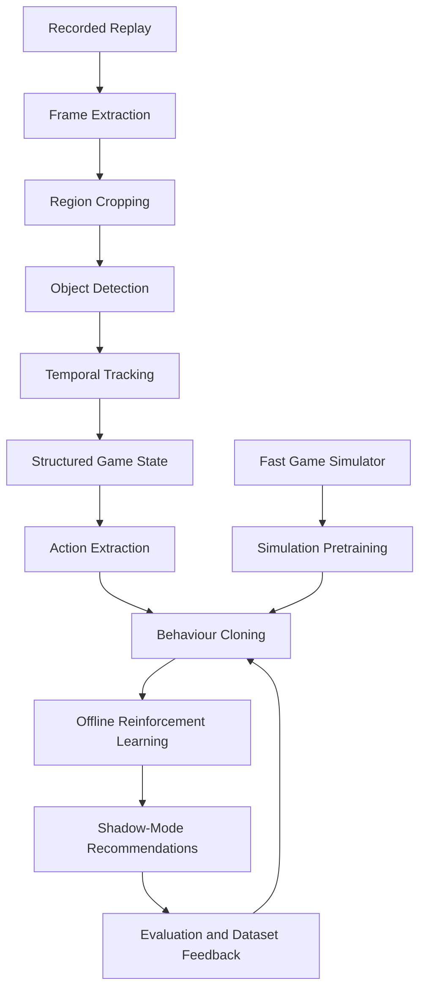

<p align="center">
  
</p>

<p align="center">
  <strong>A computer-vision and machine-learning pipeline for understanding Clash Royale gameplay from recorded replays.</strong>
</p>

<p align="center">
  
  
  
  
</p>

# ClashRoyaleML

ClashRoyaleML is an experimental pipeline for converting recorded Clash Royale matches into structured machine-learning data. The long-term goal is to reconstruct game state from video, learn decision patterns from replays, and evaluate recommendations in real time.

The project is being built incrementally, beginning with reliable replay ingestion before moving into computer vision, temporal tracking, imitation learning, offline reinforcement learning, and simulation.

> [!IMPORTANT]
> This project is intended for education and research. It is not affiliated with, endorsed by, or sponsored by Supercell. Automated gameplay may violate Supercell's rules, so the planned real-game component is a shadow-mode recommendation system rather than account automation.

## Current Status

**Milestone 0 - Replay ingestion: complete**

The first replay was successfully processed with the following properties:

| Property | Result |
|---|---:|
| Resolution | `720 × 1612` |
| Source FPS | `57.589` |
| Source frames | `18,157` |
| Duration | `315.28 seconds` |
| Sampling rate | `2 FPS` |
| Exported frames | `631` |
| Manifest | `manifest.jsonl` generated successfully |

The current pipeline can:

- Validate the Python, OpenCV, and NumPy environment.
- Inspect MP4 metadata.
- Export timestamped replay frames.
- Apply normalized crops during extraction.
- Generate a JSONL manifest linking each image to its source timestamp and frame index.
- Keep raw videos, generated frames, and virtual environments out of Git.
- Extract normalized regions and four individual card slots from portrait replays.
- Classify card slots across multiple matches, including Cannon Evolution as a distinct visual class.
- Build leakage-safe, match-level neural-training manifests without copying source images.
- Fine-tune and evaluate a MobileNetV3-Small card classifier with unknown rejection.

## Neural Card Classifier

The first neural perception stage uses ten visual classes: the eight deck cards, Cannon Evolution, and empty slots. Cannon Evolution remains a distinct visual label but maps to logical card `cannon` with `is_evolved=true`. Unknown, transition, ambiguous, partially visible, and bad-crop samples are excluded from supervised card labels.

Prepare a complete-match train/validation/test split:

```powershell
python scripts/prepare_card_training_data.py
```

Train MobileNetV3-Small (CUDA is selected automatically when available):

```powershell
python scripts/train_card_classifier.py
```

Evaluate only the held-out test match:

```powershell
python scripts/evaluate_card_classifier.py
```

Predict one image or every image beneath a directory:

```powershell
python scripts/predict_card.py path/to/card.jpg --confidence-threshold 0.65
```

Generated manifests live under `data/card_training/`; checkpoints and evaluation artifacts live under `models/card_classifier_v1/`. Both are ignored by Git.

## Elixir Recognition

The elixir stage uses the fixed `554 x 61` ROI. Inspection showed that the displayed numeral is the strongest direct integer signal, while per-segment purple occupancy and total fill provide deterministic agreement and confidence checks. The initial implementation therefore uses learned numeral/segment prototypes rather than an unnecessary neural network.

Inspect all matches and generate signal-analysis contact sheets:

```powershell
python scripts/inspect_elixir_crops.py
```

Label with the keyboard (`0`-`9`, `T` for 10, `U` for unknown, `Q` to save and quit):

```powershell
python scripts/label_elixir_frames.py
```

Labels resume safely and visually identical consecutive crops are propagated automatically. After every value is represented across at least three matches:

```powershell
python scripts/train_elixir_classifier.py
python scripts/evaluate_elixir_classifier.py
python scripts/predict_elixir.py path/to/elixir/crop.jpg
```

For a chronological directory, add `--temporal-smoothing`. An optional card-play CSV containing `timestamp_ms,elixir_cost` allows legitimate spending decreases; unexplained impossible jumps are suppressed.

## Timer Recognition

Timer crops use a fixed `125 x 83` layout. Regulation (`Time left`) and overtime retain identical `M:SS` character positions, so the timer stage uses deterministic per-position digit templates rather than general OCR. Header/background detection selects regulation versus overtime, configurable phase rules map the independent timer reading to an elixir phase, and temporal smoothing enforces countdown physics.

```powershell
python scripts/inspect_timer_crops.py
python scripts/label_timer_frames.py --stratified
python scripts/train_timer_recognizer.py
python scripts/evaluate_timer_recognizer.py
python scripts/predict_timer.py path/to/timer.jpg
```

The stratified label run requests 44 representative decisions by default: 20 from the training match and 12 each from validation and held-out test matches. Type `M:SS` and Enter, `U` for unknown, or `Q` to save and resume later. Phase thresholds live in `config/timer_phase_rules.json` and must be reviewed for other game modes or future rule changes.

## Project Vision



The intended three-stage learning strategy is:

1. **Simulation pretraining** - learn broad strategy through large numbers of accelerated theoretical matches.
2. **Replay alignment** - correct simulation assumptions using decisions and outcomes reconstructed from real gameplay.
3. **Live shadow evaluation** - observe real matches, recommend actions, and measure whether predicted decisions are useful.

## Repository Structure

```text
ClashRoyaleML/
├── assets/
│   └── clashroyaleml-banner.svg
├── data/
│   ├── raw_videos/          # Local MP4 recordings; ignored by Git
│   └── frames/              # Generated images/manifests; ignored by Git
├── scripts/
│   ├── check_setup.py       # Validates Python, OpenCV, and NumPy
│   ├── inspect_video.py     # Reads video metadata and saves the first frame
│   └── extract_frames.py    # Samples timestamped frames and writes JSONL
├── tests/
│   └── test_crop.py
├── .gitignore
├── requirements.txt
└── README.md
```

## Setup

### Requirements

- Windows 10 or 11
- Python 3.11
- Git
- One portrait Clash Royale replay saved as MP4

### Create the virtual environment

```powershell
py -3.11 -m venv .venv
Set-ExecutionPolicy -Scope Process -ExecutionPolicy Bypass
.\.venv\Scripts\Activate.ps1
python -m pip install --upgrade pip
python -m pip install -r requirements.txt
```

Always prefer `python -m pip` instead of plain `pip` so packages are installed into the active Python environment.

### Verify the installation

```powershell
python scripts/check_setup.py
```

Expected output:

```text
Python: 3.11.x
OpenCV: 4.x
NumPy: 1.x or 2.x
Setup passed.
```

## Process a Replay

Place an MP4 at:

```text
data/raw_videos/match_001.mp4
```

Inspect it:

```powershell
python scripts/inspect_video.py data/raw_videos/match_001.mp4
```

Extract two frames per second:

```powershell
python scripts/extract_frames.py `
  data/raw_videos/match_001.mp4 `
  --output data/frames/match_001 `
  --sample-fps 2
```

Count the exported images:

```powershell
(Get-ChildItem data\frames\match_001\*.jpg).Count
```

## Roadmap

### Milestone 1 - Regions of Interest

- [ ] Define normalized regions for the arena, hand, elixir, timer, and tower health.
- [ ] Add a visual region-overlay tool.
- [ ] Export separate crops for each region.
- [ ] Validate the layout across several frames.

### Milestone 2 - Visual Perception

- [ ] Install the object-detection stack.
- [ ] Detect troops, buildings, towers, and deployed cards.
- [ ] Recognize the four cards in hand.
- [ ] Estimate elixir and read the match timer.
- [ ] Produce an annotated output video.

### Milestone 3 - Temporal State Reconstruction

- [ ] Track detected entities between frames.
- [ ] Estimate movement, health, ownership, and position.
- [ ] Reconstruct card deployments and card rotation.
- [ ] Serialize structured game-state sequences.

### Milestone 4 - Decision Dataset

- [ ] Extract `(state, action, next_state)` transitions.
- [ ] Create train, validation, and test splits by match.
- [ ] Add confidence filtering for noisy perception.
- [ ] Build dataset inspection and replay tools.

### Milestone 5 - Behaviour Cloning

- [ ] Train a baseline policy on replay actions.
- [ ] Predict wait/play, card choice, placement, and timing.
- [ ] Measure card accuracy, placement error, and legality.
- [ ] Compare against simple scripted baselines.

### Milestone 6 - Offline Reinforcement Learning

- [ ] Define rewards from tower damage, elixir trades, and match outcome.
- [ ] Add sequence models such as a Decision Transformer.
- [ ] Compare imitation learning against reward-conditioned policies.
- [ ] Evaluate against held-out replay situations.

### Milestone 7 - Shadow Mode

- [ ] Capture the live PC game window.
- [ ] Run perception and policy inference in real time.
- [ ] Display recommended card, placement, confidence, and expected outcome.
- [ ] Log recommendations and observed outcomes without automating gameplay.

### Milestone 8 - Simulation Layer

- [ ] Implement a simplified fast game engine.
- [ ] Train against scripted opponents and historical checkpoints.
- [ ] Randomize timing and interaction parameters.
- [ ] Align simulator behaviour using real replay observations.
- [ ] Combine simulation pretraining with replay-based fine-tuning.

## Immediate Next Step

The next task is to add a region-of-interest visualizer for the `720 × 1612` recording format.

It should display and export boxes for:

- Battlefield/arena
- Four-card hand
- Next-card preview
- Elixir bar/value
- Match timer
- Friendly and enemy tower areas

The output will become the foundation for every perception model that follows.

## Data and Version-Control Policy

The following remain local and are ignored by Git:

- Virtual environments
- Raw screen recordings
- Extracted JPG frames
- Generated manifests and model outputs
- Trained checkpoints

Only reproducible source code, configuration files, documentation, and lightweight sample assets should be committed.

## Naming

The working project name is **ClashRoyaleML**. A future rename may be appropriate before public release to make the unofficial and research-focused nature of the project even clearer.

## Acknowledgements

The project is inspired by research and open-source work on visual game agents, particularly the idea of reconstructing structured game states from video before training decision models.

Clash Royale and related names are trademarks of Supercell. All original game assets belong to their respective owners.
